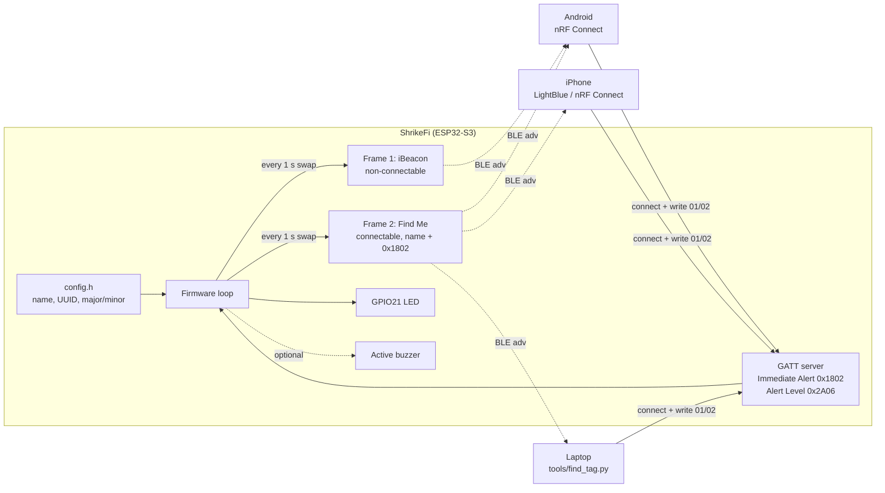

# ShrikeFi BLE Tag

**An open, AirTag-*style* Bluetooth LE finder tag built on the [Vicharak ShrikeFi](https://vicharak-in.github.io/shrike/) (ESP32-S3 + Renesas ForgeFPGA).**

Lose your bag, keys or bike? Clip a ShrikeFi to it. The board continuously advertises over Bluetooth Low Energy; your phone sees it, shows how strong the signal is ("hotter / colder") and can make the tag **blink (and beep)** so you can find it — just like the "Play Sound" / proximity part of an AirTag.

> [!IMPORTANT]
> **This is not an Apple AirTag and it does not work with Apple's Find My app or network.**
> It is a local BLE beacon: you can find it only when **your own phone** is within Bluetooth range (roughly 10–30 m indoors, more outdoors). There is no crowd-sourced, worldwide location. See [Limitations](#limitations).

Built for the **Vicharak Fellowship 2026** challenge *"can we make an AirTag using ShrikeFi?"* — with complete documentation so anyone with a ShrikeFi can reproduce it.

<!-- TODO: add photo / GIF of the board + phone here: docs/images/hero.jpg -->

---

## Contents

- [Features](#features)
- [Hardware](#hardware)
- [Quick start](#quick-start)
- [Find the tag with your phone](#find-the-tag-with-your-phone)
- [Last-seen map](#last-seen-map)
- [Onboard GPS (roadmap)](#onboard-gps-roadmap--neo-m8n)
- [How it works](#how-it-works)
- [Configuration](#configuration)
- [Limitations](#limitations)
- [Roadmap](#roadmap)
- [Repository layout](#repository-layout)
- [Credits and license](#credits-and-license)

## Features

| | v0.1 (this release) |
|---|---|
| 📡 **iBeacon advertising** | Your own 128-bit UUID + Major/Minor + calibrated 1 m power, readable by any beacon scanner app |
| 🔔 **"Find Me" alert** | Standard Bluetooth SIG **Immediate Alert Service (0x1802)** — write `1` (mild) or `2` (high) from a phone and the tag blinks fast / beeps; `0` stops it; auto-stops after 15 s |
| 📱 **Works on Android *and* iPhone** | Tested flow with **nRF Connect** and **LightBlue** (free apps) — no custom app needed |
| 💡 **Status LED (GPIO21)** | heartbeat blink = advertising · solid = phone connected · fast blink = alert |
| 🔊 **Optional buzzer** | any 3.3 V *active* buzzer on a spare GPIO |
| 💻 **Laptop finder** | [`tools/find_tag.py`](tools/find_tag.py) — live RSSI bar + distance estimate + alert trigger (Windows / Linux / macOS) |
| 🗺️ **Last-seen map (phone)** | [`companion/`](companion/) PWA — Web Bluetooth + phone GPS pins on a Leaflet map (**Android Chrome**; not Find My / no onboard GPS) |
| 🛠️ **Beginner-friendly build** | Arduino IDE **or** PlatformIO, one config file |

## Hardware

**You need only:** a ShrikeFi board and a **USB-C *data* cable** (charge-only cables will not flash). Full list in [docs/BOM.md](docs/BOM.md).

| ShrikeFi feature | Used for |
|---|---|
| ESP32-S3 (dual-core LX7, 240 MHz) | runs the firmware |
| Bluetooth LE 5.0 radio (on-chip) | beacon advertising + GATT alert service |
| MCU user LED — **GPIO21**, active high | status / alert indicator |
| Dual USB-C (CH9102 USB-UART + native USB) | power, flashing, serial log |
| Renesas SLG47910 ForgeFPGA | *not used in v0.1* — see [Roadmap](#roadmap) |
| Optional BMS / LiPo charger (DNP on base board) | *not required* — power from USB-C or a power bank |

Board docs: [Hardware overview](https://vicharak-in.github.io/shrike/hardware_overview.html) · [Pinouts](https://vicharak-in.github.io/shrike/shrike_pinouts.html) · [Getting started](https://vicharak-in.github.io/shrike/getting_started.html)

## Quick start

Full step-by-step guide with screenshots-to-take and troubleshooting: **[docs/HOWTO.md](docs/HOWTO.md)**.

### Option A — Arduino IDE (easiest)

1. Install [Arduino IDE 2.x](https://www.arduino.cc/en/software).
2. **File → Preferences → Additional boards manager URLs**, add (same as [Vicharak's guide](https://vicharak-in.github.io/shrike/getting_started.html)):
   ```
   https://raw.githubusercontent.com/espressif/arduino-esp32/gh-pages/package_esp32_index.json
   ```
3. **Tools → Board → Boards Manager** → install **"esp32" by Espressif Systems** (3.x).
4. Open `firmware/ShrikeFiBleTag/ShrikeFiBleTag.ino`. Edit `config.h` (at least generate your own `IBEACON_UUID`).
5. **Tools** menu:
   | Setting | Value |
   |---|---|
   | Board | **ESP32S3 Dev Module** (Vicharak's guide calls it "Generic ESP32-S3") |
   | Port | the ShrikeFi's COM / tty port |
   | USB Mode | Hardware CDC and JTAG |
   | USB CDC On Boot | **Disabled** if plugged into the CH9102 USB-UART port · **Enabled** if plugged into the native ESP32-S3 USB port |
   | Flash Size | **4MB** (safe on every ShrikeFi; firmware is ~0.6 MB) — 8MB as in Vicharak's guide also works if your board has 8 MB |
   | Partition Scheme | Default |
   | Upload Speed | 460800 (drop to 115200 if uploads fail) |
6. Click **Upload**. First time only: if upload fails with *"Failed to connect"*, **hold BOOT while plugging in the cable** (or hold BOOT, tap RESET, release BOOT), then upload again.
7. Open **Serial Monitor at 115200** and press RESET — you should see the tag's name, MAC, UUID; the blue LED blinks once a second.

### Option B — PlatformIO (CLI or VS Code)

```bash
pip install platformio            # or install the PlatformIO IDE extension in VS Code
cd firmware
pio run -e shrikefi -t upload     # CH9102 USB-UART port
pio device monitor                # 115200 baud
# native USB port instead:  pio run -e shrikefi_native_usb -t upload
```

## Find the tag with your phone

Install a free BLE scanner — **nRF Connect for Mobile** (Nordic Semiconductor; Android & iOS) or **LightBlue** (Punch Through; iOS & Android).

| | Android (tested target: OnePlus 11 5G) | iPhone (tested target: iPhone 14 / 15) |
|---|---|---|
| Sees `ShrikeFi-Tag` by name | ✅ | ✅ |
| Live RSSI ("hotter / colder") | ✅ nRF Connect RSSI + graph | ✅ RSSI in device list / LightBlue signal view |
| Sees the **iBeacon** frame (UUID, Major, Minor) | ✅ nRF Connect decodes it | ❌ iOS hides iBeacon packets from Bluetooth apps by design (only Core Location beacon apps that know your UUID can range it) |
| Make the tag blink / beep | ✅ connect → *Immediate Alert* → write `01`/`02` | ✅ connect → service `1802` → *Alert Level* → write `01`/`02` |

1. Power the tag (USB-C to laptop or power bank). LED blinks once per second.
2. Open the app → **Scan** → find **ShrikeFi-Tag** (use the name filter).
3. **Find by signal:** walk around and watch RSSI. ≈ −50 dBm = right next to you, −70 = same room, −90 = far / behind walls.
4. **Make it blink:** tap **Connect** → *Immediate Alert* service (`0x1802`) → *Alert Level* (`0x2A06`) → write **`02`** (high, fast blink) or **`01`** (mild) → write **`00`** to stop.

Detailed per-app taps, Android permissions (Nearby devices / Location) and calibration: [docs/HOWTO.md](docs/HOWTO.md#4-test-with-your-phone).


## Last-seen map

A single-page companion under [`companion/`](companion/) records **where your phone was** when it last saw the tag (Web Bluetooth + geolocation), and shows pins + a short trail on an offline-friendly Leaflet / OpenStreetMap map.

> **Not Apple Find My.** The ShrikeFi has **no GPS**. Pins are phone-GPS “last sightings” while *you* are in BLE range — not a crowd-sourced world map.

| | |
|---|---|
| **Best on** | **Android Chrome** (OnePlus and similar) |
| **iPhone** | Safari usually lacks Web Bluetooth — keep using **LightBlue** / nRF Connect for find-me; the map companion is Android-primary |
| **How to open** | **GitHub Pages:** [geneticscrol.github.io/shrikefi-ble-tag/companion/](https://geneticscrol.github.io/shrikefi-ble-tag/companion/) · or local `python -m http.server` + `adb reverse` — see [`companion/README.md`](companion/README.md) |
| **Usage** | **Connect to tag** → auto pins while connected · **Mark last seen** for a manual pin · trail stored in the browser (`localStorage`) |

Step-by-step, screenshots and limitations: [docs/HOWTO.md §8](docs/HOWTO.md#8-last-seen-map-companion-android-chrome) · measured session: [docs/TEST_LOG.md](docs/TEST_LOG.md).

## Onboard GPS (roadmap) — NEO-M8N

A **u-blox NEO-M8N** GNSS module will be wired to the ShrikeFi over **UART** so the tag can store its own **lat/lng** outdoors (no phone required for the fix). Until that lands:

- Location in the repo today is still **phone last-seen** via the [companion](https://geneticscrol.github.io/shrikefi-ble-tag/companion/) (Web Bluetooth + phone GPS).
- NEO-M8N is **outdoor-oriented** (needs sky view); indoor find-me stays BLE RSSI + Find Me alert.
- Firmware will read NMEA / u-blox over UART; exact pins and power notes will land with the hardware hookup.


## How it works



1. **Two advertising frames, alternated every second.**
   - **iBeacon frame** (non-connectable): Apple's iBeacon manufacturer-data layout (`4C 00 02 15` + UUID + Major + Minor + measured power). Beacon apps use it to identify *your* tag and estimate distance.
   - **Find Me frame** (connectable): flags + 16-bit service UUID `0x1802` + complete local name. This is the frame iPhones can see, and the one a phone connects to.
   Why two? iOS/macOS strip any advertisement containing iBeacon data from normal Bluetooth (CoreBluetooth) apps. Splitting them means every phone sees *something*.
2. **Distance from RSSI.** Phones measure received signal strength (RSSI, dBm). With the 1 m reference (`IBEACON_MEASURED_POWER`, default −59 dBm) a rough distance is `d ≈ 10^((P₁ₘ − RSSI) / (10·n))`, `n ≈ 2` (open air) … 3 (indoors). Treat it as *warmer/colder*, not metres.
3. **Find Me alert.** The firmware hosts the Bluetooth SIG **Immediate Alert Service**. When a phone writes Alert Level `1`/`2`, the LED (and optional buzzer) switch to a fast pattern for 15 s or until `0` is written. While a phone is connected the tag keeps advertising the iBeacon frame.
4. **Portable code.** Builds on Arduino-ESP32 **3.x (NimBLE host)** and **2.0.x (Bluedroid)**; the few API differences are handled in the sketch.

Data flow, packet bytes and design decisions are explained in more depth in [docs/HOWTO.md](docs/HOWTO.md#6-how-the-firmware-works) and the blog draft [docs/BLOG_DRAFT.md](docs/BLOG_DRAFT.md).

## Configuration

Everything lives in [`firmware/ShrikeFiBleTag/config.h`](firmware/ShrikeFiBleTag/config.h):

| Setting | Default | Meaning |
|---|---|---|
| `TAG_NAME` | `ShrikeFi-Tag` | name shown in scanner apps (≤ 12 chars) |
| `IBEACON_UUID` | example UUID | **replace with your own** (`uuidgen` / `python -c "import uuid;print(uuid.uuid4())"`) |
| `IBEACON_MAJOR` / `IBEACON_MINOR` | 1 / 1 | tell multiple tags apart |
| `IBEACON_MEASURED_POWER` | −59 | RSSI at 1 m, calibrate for better distance |
| `ENABLE_IBEACON_FRAME` / `ENABLE_FINDME_FRAME` | 1 / 1 | turn either frame off |
| `FRAME_SWITCH_MS` | 1000 | how long each frame is advertised |
| `ADV_INTERVAL_MS` | 200 | lower = faster RSSI updates, higher = less power |
| `LED_PIN` | 21 | ShrikeFi MCU LED |
| `BUZZER_PIN` | −1 | GPIO of an optional active buzzer |
| `ALERT_DURATION_MS` | 15000 | alert auto-stop |

## Limitations

Being honest about what this is (and isn't):

- **No Apple Find My / Google Find My Device network.** Those networks rely on manufacturer-certified accessories (Apple MFi / Google's Find Hub spec), rotating cryptographic keys and millions of phones relaying encrypted locations. This project does none of that. Community reverse-engineering projects (e.g. OpenHaystack) exist, but they are unofficial, fragile, not first-class on ESP32-S3 and **not used or claimed here**.
- **Range-limited.** You can only find the tag when your phone is within BLE range. The tag has **no onboard GPS**; the [`companion/`](companion/) last-seen map uses **your phone’s GPS** when the tag is nearby (Android Chrome). There is still no crowd-sourced worldwide location.
- **RSSI is noisy.** Bodies, walls, board orientation and the breadboard (the ShrikeFi antenna is sensitive to nearby metal — [discussion](https://discuss.vicharak.in/t/issue-with-the-antenna-of-shrike-fi/417)) easily swing ±5–10 dB.
- **iPhone can't see the iBeacon frame** in LightBlue / nRF Connect (iOS policy). The Find Me frame works fine.
- **Privacy.** The tag uses a fixed Bluetooth address and fixed UUID, so anyone with a scanner can recognise it. Real AirTags rotate identifiers and include anti-stalking alerts. **Only attach this to your own belongings — never use it to track people.**
- **Power.** The base ShrikeFi has the battery charger/BMS *not populated*, and v0.1 does not use deep sleep, so expect power-bank/USB power rather than coin-cell life.
- **Trademarks.** "AirTag", "iBeacon" and "Find My" are trademarks of Apple Inc. This project is not affiliated with or endorsed by Apple. The iBeacon packet layout is used here for hobby/educational interoperability.

## Roadmap

- [ ] **FPGA status LED** — drive the ForgeFPGA user LED (FPGA GPIO16) with a hardware pattern generator, triggered by the MCU over the FPGA–MCU link (shows *why ShrikeFi* instead of a bare ESP32).
- [ ] **Low-power mode** — longer advertising interval + light sleep; measure current; LiPo via the optional BMS.
- [ ] **Link-loss / "left behind" alert** (Bluetooth Link Loss Service 0x1803).
- [x] **Last-seen map companion** (PWA) — [`companion/`](companion/) Web Bluetooth + phone GPS pins (Android Chrome) · [Pages](https://geneticscrol.github.io/shrikefi-ble-tag/companion/).
- [ ] **NEO-M8N onboard GPS** — UART lat/lng outdoors; phone last-seen remains until then (see [Onboard GPS](#onboard-gps-roadmap--neo-m8n)).
- [ ] **Richer companion** (Flutter / Capacitor) — UUID filter, hot/cold gauge, richer history UI.
- [ ] **Eddystone-UID** frame option (Google's open beacon format).
- [ ] Button on a GPIO to toggle beacon / pairing mode.

## Repository layout

```
shrikefi-ble-tag/
├── firmware/
│   ├── platformio.ini                # PlatformIO envs (CH9102 port, native USB, core 2.x)
│   └── ShrikeFiBleTag/
│       ├── ShrikeFiBleTag.ino        # firmware (open this in Arduino IDE)
│       └── config.h                  # ← your settings
├── companion/                        # last-seen map PWA (Android Chrome)
│   ├── index.html / app.js / styles.css
│   ├── manifest.webmanifest / sw.js
│   └── README.md                     # how to open on OnePlus
├── tools/
│   └── find_tag.py                   # laptop finder (Python + bleak)
├── docs/
│   ├── HOWTO.md                      # build, flash, phone test, calibration, troubleshooting
│   ├── BOM.md                        # bill of materials
│   ├── BLOG_DRAFT.md                 # draft article for blog.vicharak.in
│   ├── TEST_LOG.md                   # measured RSSI / companion session notes
│   ├── screenshots/                  # privacy-scrubbed nRF + companion captures
│   └── images/                       # photos & screenshots for docs/blog
└── LICENSE                           # MIT
```

## Credits and license

- Hardware: [Vicharak](https://vicharak.in) ShrikeFi — docs at <https://vicharak-in.github.io/shrike/>, community on [Discord](https://discord.com/invite/EhQy97CQ9G).
- Arduino core: [espressif/arduino-esp32](https://github.com/espressif/arduino-esp32). Laptop scanner: [bleak](https://github.com/hbldh/bleak).
- Author: **Saksham Sud** ([@Geneticscrol](https://github.com/Geneticscrol)), Vicharak Campus Fellow 2026.

Released under the [MIT License](LICENSE).
