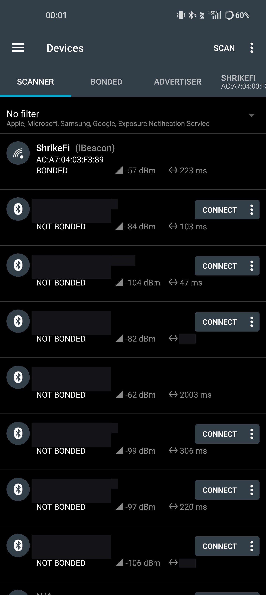
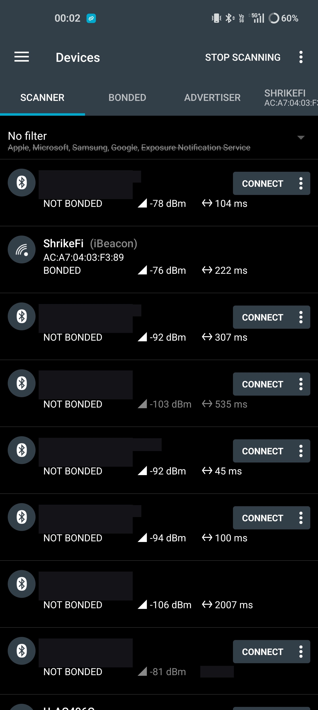
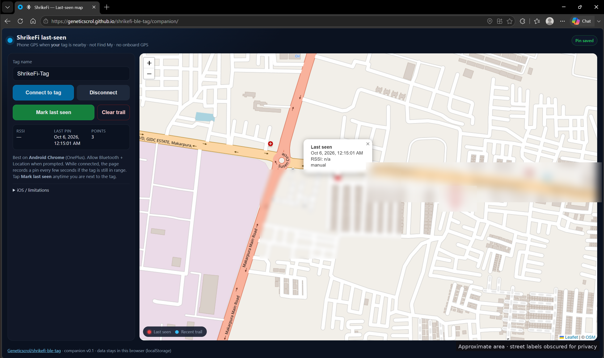

# HOWTO — build, flash and test the ShrikeFi BLE Tag

This guide assumes **no prior ESP32 experience**. Total time: ~20 minutes (most of it is downloading the toolchain the first time).

1. [What you need](#1-what-you-need)
2. [Prepare your computer](#2-prepare-your-computer)
3. [Build and flash](#3-build-and-flash) — Arduino IDE · PlatformIO · esptool (prebuilt binary)
4. [Test with your phone](#4-test-with-your-phone) — Android · iPhone · laptop
5. [Calibrate distance and measure range](#5-calibrate-distance-and-measure-range)
6. [How the firmware works](#6-how-the-firmware-works)
7. [Troubleshooting](#7-troubleshooting)
8. [Last-seen map companion (Android Chrome)](#8-last-seen-map-companion-android-chrome)

---

## 1. What you need

| Item | Notes |
|---|---|
| Vicharak **ShrikeFi** | base version is fine — no PSRAM, BMS or FPGA bitstream needed |
| **USB-C data cable** | must carry data. If no serial port appears when you plug in, try another cable first |
| Computer | Windows 10/11, Linux or macOS |
| Phone | any Android 8+ or iPhone with Bluetooth LE (tested targets: **OnePlus 11 5G**, **iPhone 14 / 15**) |
| Phone app (free) | **nRF Connect for Mobile** (Nordic Semiconductor) and/or **LightBlue** (Punch Through); optional last-seen map: [`companion/`](../companion/) in **Android Chrome** |
| *Optional* | USB power bank (to walk around with the tag), 3.3 V **active** buzzer + 2 jumper wires |

## 2. Prepare your computer

### 2.1 Which USB-C port?

ShrikeFi has **two USB-C ports**:

| Port | Chip | Shows up as | Use with |
|---|---|---|---|
| **USB-UART** | WCH **CH9102** → ESP32-S3 UART0 (GPIO43/44) | Windows `COMx` "USB-Enhanced-SERIAL CH9102"/"USB Single Serial"; Linux `/dev/ttyACM0` or `/dev/ttyUSB0`; macOS `/dev/cu.wchusbserial*` | **recommended** — auto-reset into bootloader usually works |
| **Native USB** | ESP32-S3 USB Serial/JTAG (GPIO19/20) | "USB JTAG/serial debug unit" (Espressif, VID 303A); Linux `/dev/ttyACM0`; macOS `/dev/cu.usbmodem*` | works too — set *USB CDC On Boot = Enabled* to see Serial output |

Not sure which is which? Plug into one port and look at Device Manager (Windows), `ls /dev/tty*` (Linux) or `ls /dev/cu.*` (macOS).

### 2.2 Drivers / permissions

- **Windows**: the CH9102 normally installs automatically. If it shows as an unknown device, install WCH's **CH343/CH9102 driver** (`CH343SER`) from wch-ic.com.
- **macOS**: recent macOS includes a driver; if no `/dev/cu.*` port appears, install WCH's CH34x/CH9102 macOS driver.
- **Linux**: no driver needed. Give yourself serial-port access once, then log out/in:
  ```bash
  sudo usermod -aG dialout $USER     # Arch/Fedora: uucp
  ```

### 2.3 Generate your own UUID

Every tag should have a unique iBeacon UUID. Run one of:

```bash
uuidgen                                         # Linux / macOS
python -c "import uuid; print(uuid.uuid4())"    # any OS with Python
```
```powershell
[guid]::NewGuid()                                # Windows PowerShell
```

Paste it into `firmware/ShrikeFiBleTag/config.h`:

```c
#define IBEACON_UUID "1B6295D5-4F74-4C58-A2D8-CD83CA26BDF4"   // <- yours
```

Also consider changing `TAG_NAME` (≤ 12 characters, e.g. `Saksham-Keys`).

## 3. Build and flash

Pick **one** of the three methods.

### Method A — Arduino IDE 2.x (recommended for beginners)

These steps follow Vicharak's official [Getting Started — Arduino IDE](https://vicharak-in.github.io/shrike/getting_started.html) guide (you do **not** need the LittleFS tool or the Shrike library for this project — those are for FPGA bitstreams).

1. Install **Arduino IDE 2.x** from <https://www.arduino.cc/en/software>.
2. **File → Preferences → Additional boards manager URLs** → add:
   ```
   https://raw.githubusercontent.com/espressif/arduino-esp32/gh-pages/package_esp32_index.json
   ```
3. **Tools → Board → Boards Manager…** → search **esp32** → install **"esp32" by Espressif Systems** (version 3.x; 2.0.x also works).
4. Download this repo (**Code → Download ZIP** on GitHub, or `git clone https://github.com/Geneticscrol/shrikefi-ble-tag`).
5. **File → Open…** → `firmware/ShrikeFiBleTag/ShrikeFiBleTag.ino`. The `config.h` tab opens next to it — edit it (step 2.3).
6. Plug the ShrikeFi into the **CH9102** port and set the **Tools** menu:

   | Setting | Value |
   |---|---|
   | Board | **esp32 → ESP32S3 Dev Module** |
   | Port | the ShrikeFi's port |
   | USB Mode | Hardware CDC and JTAG |
   | USB CDC On Boot | **Disabled** (CH9102 port) — use **Enabled** only if you are on the native USB port |
   | CPU Frequency | 240 MHz (WiFi) |
   | Flash Size | **4MB (32Mb)** — always safe. Vicharak's guide uses 8MB; that also works if your board's flash is 8 MB |
   | Partition Scheme | Default 4MB with spiffs |
   | PSRAM | Disabled |
   | Upload Speed | 460800 (921600 often works; 115200 if uploads fail) |

7. Click **Upload** (→). The first build takes a couple of minutes.
   - If you get **"Failed to connect to ESP32-S3: No serial data received"**: hold the **BOOT** button, tap **RESET**, release **BOOT** (or hold BOOT while plugging the cable in), then click Upload again. Vicharak notes this is usually needed only the first time.
8. After *"Hard resetting via RTS pin…"*, open **Tools → Serial Monitor**, set **115200 baud**, and press **RESET** on the board. You should see:

   ```
   === ShrikeFi BLE Tag v0.1.0 ===
   Open BLE beacon - NOT an Apple AirTag / Find My device.
   Name   : ShrikeFi-Tag
   MAC    : xx:xx:xx:xx:xx:xx
   UUID   : 5F1C0DE0-5B1E-4A6F-9E2A-5A4B5341D001
   Major  : 1  Minor: 1  Measured power: -59 dBm
   Frames : iBeacon=on FindMe=on (switch every 1000 ms, interval 200 ms)
   Advertising... (LED blinks once per second)
   ```

   and the **MCU LED (GPIO21)** gives a short blink every second. 🎉 Write down the MAC — Android shows it in scanner apps.

### Method B — PlatformIO

```bash
pip install platformio                 # or: VS Code → Extensions → "PlatformIO IDE"
git clone https://github.com/Geneticscrol/shrikefi-ble-tag
cd shrikefi-ble-tag/firmware
# edit ShrikeFiBleTag/config.h
pio run -e shrikefi -t upload          # board on the CH9102 port
pio device monitor                     # 115200 baud, Ctrl+C to quit
```

Environments in `platformio.ini`:

| env | When |
|---|---|
| `shrikefi` (default) | CH9102 USB-UART port, Arduino-ESP32 3.x (pioarduino platform) |
| `shrikefi_native_usb` | native ESP32-S3 USB port (Serial over USB CDC) |
| `shrikefi_core2` | official PlatformIO `espressif32` platform (Arduino-ESP32 2.0.x) — fallback |

Add `--upload-port COM5` / `--upload-port /dev/ttyACM0` if PlatformIO picks the wrong port. BOOT/RESET trick from Method A applies if the upload can't connect.

### Method C — esptool + prebuilt binary (no IDE)

If a release binary is attached to the [Releases page](https://github.com/Geneticscrol/shrikefi-ble-tag/releases) (`shrikefi-ble-tag-vX.Y.Z-merged.bin`, built with the **default** `config.h`), you can flash it directly — the same way Vicharak's guide flashes MicroPython:

```bash
pip install esptool
python -m esptool --chip esp32s3 erase_flash          # optional, wipes the board
python -m esptool --chip esp32s3 -b 460800 --before default_reset --after hard_reset \
    write_flash --flash_mode dio --flash_size 4MB --flash_freq 80m \
    0x0 shrikefi-ble-tag-v0.1.0-merged.bin
```

Add `--port COM5` (Windows) or `--port /dev/ttyACM0` (Linux) if needed. The prebuilt binary uses the **example UUID and name** — build from source (A or B) to personalise your tag. To view the log: any serial terminal at 115200 (e.g. `python -m serial.tools.miniterm /dev/ttyACM0 115200`).

> To make your own merged binary from Arduino IDE: **Sketch → Export Compiled Binary** → use `ShrikeFiBleTag.ino.merged.bin` from the `build/` folder.

## 4. Test with your phone

Power the tag from your laptop or a power bank. LED blinks once per second = advertising.

> **Tip (from the Vicharak forum):** the ShrikeFi's antenna area is sensitive to nearby metal. For range tests and demo videos, take the board **off the breadboard** and keep the antenna end clear of cables and hands.

### 4.1 Android (OnePlus 11 or any Android 8+) — nRF Connect

1. Install **nRF Connect for Mobile** (Nordic Semiconductor) from Google Play.
2. Turn on **Bluetooth** (and **Location** on Android ≤ 11). On first launch allow **Nearby devices** (Android 12+) / **Location** permission — Android won't return BLE scan results otherwise.
3. **Scanner** tab → **Scan**. Tap **No filter → Name** and type `ShrikeFi` to hide other devices.
4. You'll see the tag's MAC address. Because the tag alternates frames, the row flips between:
   - **ShrikeFi-Tag** with *Immediate Alert* service — the Find Me frame
   - **iBeacon** (tap the row to expand) — shows your **UUID, Major, Minor, RSSI at 1 m** and an estimated **distance**
5. **Hot / cold search:** watch the **RSSI** value (dBm) while walking. Swipe/tap to the **Graph** view in the scanner for a live RSSI plot — great for the demo video.

   | RSSI | Roughly |
   |---|---|
   | −40 … −55 dBm | within ~1 m |
   | −55 … −70 dBm | same room |
   | −70 … −85 dBm | next room / 10+ m |
   | < −90 dBm or gone | out of range |

   Example scans on OnePlus (nRF Connect) — other nearby BLE names/MACs redacted; **ShrikeFi (iBeacon)** `AC:A7:04:03:F3:89` kept visible:

   

   *Near: ShrikeFi at **−57 dBm** (same room / within a couple of metres).*

   

   *Mid: ShrikeFi at **−76 dBm** (farther / more attenuation).*

   

   *Far: ShrikeFi at **−91 dBm** (weak / near edge of useful range).*

6. **Make the tag blink ("Play sound"):**
   1. Tap **CONNECT** on the ShrikeFi-Tag row → the LED turns **solid** (connected).
   2. Open **Immediate Alert** (0x1802) → **Alert Level** (0x2A06) → tap the **↑ (write)** icon.
   3. Choose **High Alert** (or enter `02` as BYTE/UINT8) → **SEND**. LED blinks fast (and the buzzer beeps if fitted). `01` = mild (slow blink), `00` = stop. It auto-stops after 15 s.
   4. **DISCONNECT** when done — the tag goes back to heartbeat blinking and becomes connectable again.

*Optional:* beacon-specific apps (search Play Store for "beacon scanner") can also list the iBeacon with a distance estimate.

### 4.2 iPhone (iPhone 14 / 15) — LightBlue or nRF Connect

> iOS deliberately **hides iBeacon packets** from Bluetooth apps like LightBlue and nRF Connect. You will see the tag through its **Find Me** frame (name `ShrikeFi-Tag`), which is exactly why the firmware alternates two frames. iOS also shows a random per-phone identifier instead of the MAC address — that's normal.

**LightBlue**

1. Install **LightBlue** (Punch Through) from the App Store, allow Bluetooth access.
2. In the **Peripherals** list find **ShrikeFi-Tag** (pull to refresh; use the filter to hide unnamed devices). The signal bars/number next to it is the **RSSI** — walk around to find the tag hot/cold.
3. Tap it to **connect** (LED goes solid).
4. Under **Immediate Alert** (or `0x1802`) tap **Alert Level** (`0x2A06`) → **Write new value** → enter hex **`02`** → **Done**. LED blinks fast. Write `00` to stop.

**nRF Connect (iOS)**

1. Scanner → find **ShrikeFi-Tag**, RSSI is shown on the row.
2. **Connect** → *Immediate Alert* → *Alert Level* → write ↑ → `02`.

> If the name shows as something else (e.g. a previous name), iOS has cached the GAP name — toggle Bluetooth off/on or wait; the advertised name updates on the next scan.

*iBeacon on iPhone:* only apps built on Apple's Core Location beacon API can range an iBeacon, and they must be told your exact UUID. That's a possible future companion-app feature; it is not needed for this demo.

### 4.3 Laptop — `tools/find_tag.py`

```bash
pip install bleak
python tools/find_tag.py                     # live RSSI bar + distance estimate
python tools/find_tag.py --uuid <YOUR-UUID>  # match your iBeacon frame (Windows/Linux)
python tools/find_tag.py --alert 2           # connect and make the tag blink
python tools/find_tag.py --alert 0           # stop
```

Sample output:
```
AA:BB:CC:DD:EE:FF  iBeacon 1/1    RSSI  -63.2 dBm  [################..............]  ~ 1.4 m  hot
```

## 5. Calibrate distance and measure range

### 5.1 Calibrate "measured power"

Distance estimates use `IBEACON_MEASURED_POWER` (the RSSI expected at **1 m**). To calibrate for *your* board and phone:

1. Put the tag and phone **1.0 m apart**, line of sight, tag off the breadboard.
2. In nRF Connect (Android) watch the RSSI graph for ~30 s and note the **average** (e.g. −62 dBm).
3. Set `#define IBEACON_MEASURED_POWER (-62)` in `config.h`, re-flash.

### 5.2 Range test (record results in [TEST_LOG.md](TEST_LOG.md))

Measure average RSSI at 0.5 m, 1 m, 2 m, 5 m, 10 m, 20 m (line of sight) and through one wall, on both phones. Note the distance where the tag disappears. These numbers make the blog post much stronger.

## 6. How the firmware works

File: [`firmware/ShrikeFiBleTag/ShrikeFiBleTag.ino`](../firmware/ShrikeFiBleTag/ShrikeFiBleTag.ino)

**Boot (`setup()`)**
1. Configure GPIO21 (LED) and optional buzzer pin, start Serial at 115200.
2. Parse `IBEACON_UUID` into 16 bytes; if invalid, halt with a double-blink LED pattern.
3. `BLEDevice::init(TAG_NAME)`, create a GATT server with the **Immediate Alert Service** (0x1802) holding one **Alert Level** characteristic (0x2A06, write / write-without-response / read).
4. Start advertising the first frame.

**Main loop (`loop()`, every 10 ms)**
- Every `FRAME_SWITCH_MS` stop advertising, load the other frame, restart.
- After a connect/disconnect callback, restart advertising (connectable Find Me frame is skipped while a phone is connected; iBeacon continues).
- Update LED/buzzer pattern (non-blocking, from `millis()`), auto-clear alerts after `ALERT_DURATION_MS`.

**Frame 1 — iBeacon (ADV_NONCONN_IND, 30 bytes)**

```
02 01 06                      Flags: LE General Discoverable, BR/EDR not supported
1A FF                         Manufacturer Specific Data, length 26
   4C 00                      Company ID 0x004C (little endian)
   02 15                      iBeacon type, 21 bytes follow
   5F 1C 0D E0 5B 1E 4A 6F
   9E 2A 5A 4B 53 41 D0 01    Proximity UUID (big endian)
   00 01                      Major = 1
   00 01                      Minor = 1
   C5                         Measured power = -59 dBm
```

**Frame 2 — Find Me (ADV_IND, connectable, 21 bytes)**

```
02 01 06                      Flags
03 03 02 18                   Complete list of 16-bit service UUIDs: 0x1802
0D 09 53 68 72 69 6B 65 46 69 2D 54 61 67    Complete Local Name "ShrikeFi-Tag"
```

**Why these choices?**
- *Immediate Alert Service* is a standard Bluetooth SIG service (Find Me profile), so generic apps already understand it — no custom app needed.
- *Two frames* because iOS hides iBeacon packets from CoreBluetooth apps; Android sees both.
- *Arduino-ESP32* because Vicharak's official ShrikeFi workflow is Arduino IDE; the sketch compiles on core 3.x (NimBLE host) and 2.0.x (Bluedroid).
- *No FPGA in v0.1* to keep the first version reproducible; the FPGA LED is on the roadmap.

## 7. Troubleshooting

| Symptom | Fix |
|---|---|
| No port appears | Try another **data** cable / other USB-C port; install CH9102 driver (Windows/macOS); Linux: add yourself to `dialout` |
| `Failed to connect to ESP32-S3` | Hold **BOOT**, tap **RESET**, release BOOT, upload again; lower upload speed to 115200 |
| `Permission denied: /dev/ttyACM0` | `sudo usermod -aG dialout $USER`, log out and back in |
| Upload OK but Serial Monitor is empty | Baud must be **115200**; *USB CDC On Boot* must match the port (Disabled for CH9102, Enabled for native USB); press RESET after opening the monitor |
| Board boot-loops after flashing | Set **Flash Size = 4MB** and re-flash; run `python -m esptool --chip esp32s3 erase_flash` first |
| LED double-blinks forever | `IBEACON_UUID` in `config.h` is malformed — must be 32 hex digits (dashes optional) |
| Phone doesn't see the tag | LED heartbeat present? Bluetooth (and Android Location/Nearby devices permission) on? Clear the scanner filter; move closer; take board off breadboard |
| iPhone sees name but no iBeacon | Expected — iOS hides iBeacon frames from Bluetooth apps |
| Android row "flickers" between iBeacon and ShrikeFi-Tag | Expected — two alternating frames. Set `ENABLE_IBEACON_FRAME 0` for name-only, or `ENABLE_FINDME_FRAME 0` for iBeacon-only |
| Can't connect | Another phone/laptop may already be connected (LED solid). Disconnect it first |
| RSSI jumps around a lot | Normal for BLE. Average over a few seconds, keep line of sight, calibrate (section 5) |
| Companion: “Web Bluetooth not available” | Use **Android Chrome**. iOS Safari generally cannot run this map — use LightBlue for find-me |
| Companion: Connect does nothing / SecurityError | Page must be a **secure context** (HTTPS or `http://localhost`). On OnePlus use `adb reverse` — see §8 |

## 8. Last-seen map companion (Android Chrome)

The [`companion/`](../companion/) folder is a **no-build** Progressive Web App: it connects to the tag over **Web Bluetooth**, reads the **phone’s GPS**, and drops pins on a Leaflet / OpenStreetMap map (last-seen marker + recent trail).

### What it is / isn’t

| Is | Isn’t |
|---|---|
| “Where was **my phone** when it last saw the tag?” | Apple Find My / Google Find My Device |
| Uses phone GPS + BLE proximity | Onboard GPS on the ShrikeFi (there is none) |
| Best on **Android Chrome** (OnePlus) | A full iPhone Safari solution (Web Bluetooth is usually missing — keep using LightBlue) |

### Open it on a OnePlus

1. Power the tag (LED heartbeat).
2. Serve the companion over a **secure context**:
   - **GitHub Pages** (once enabled): open the repo’s `companion/` URL in Chrome, **or**
   - On a laptop next to the phone:
     ```bash
     cd companion
     python -m http.server 8080
     adb reverse tcp:8080 tcp:8080   # USB debugging on
     ```
     Then on the phone: Chrome → `http://localhost:8080/`
3. Tap **Connect to tag** → choose **ShrikeFi-Tag** (or your custom `TAG_NAME`) → allow **Location**.
4. While connected, the page auto-drops GPS pins every few seconds (and reads RSSI when the browser supports `watchAdvertisements`). Tap **Mark last seen** for an immediate pin when you are next to the tag.
5. Pins stay in that browser’s `localStorage` until you tap **Clear trail**.

More detail: [`companion/README.md`](../companion/README.md).

### Screenshot

Live companion on GitHub Pages: [geneticscrol.github.io/shrikefi-ble-tag/companion/](https://geneticscrol.github.io/shrikefi-ble-tag/companion/).



*Last-seen pin from the companion PWA (phone GPS while the tag was nearby). Map labels around the pin are obscured for privacy; shown as an approximate Makarpura / Susen Tarsali area.*

